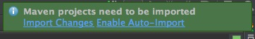
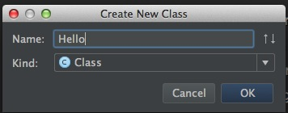
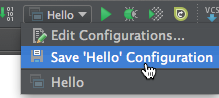
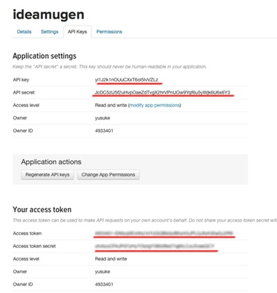
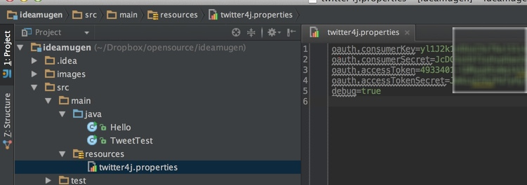
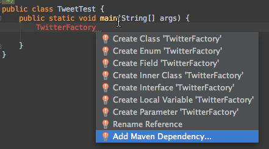
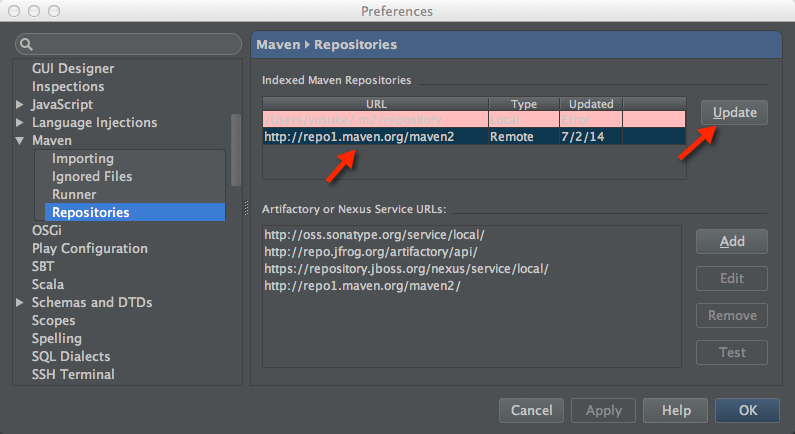
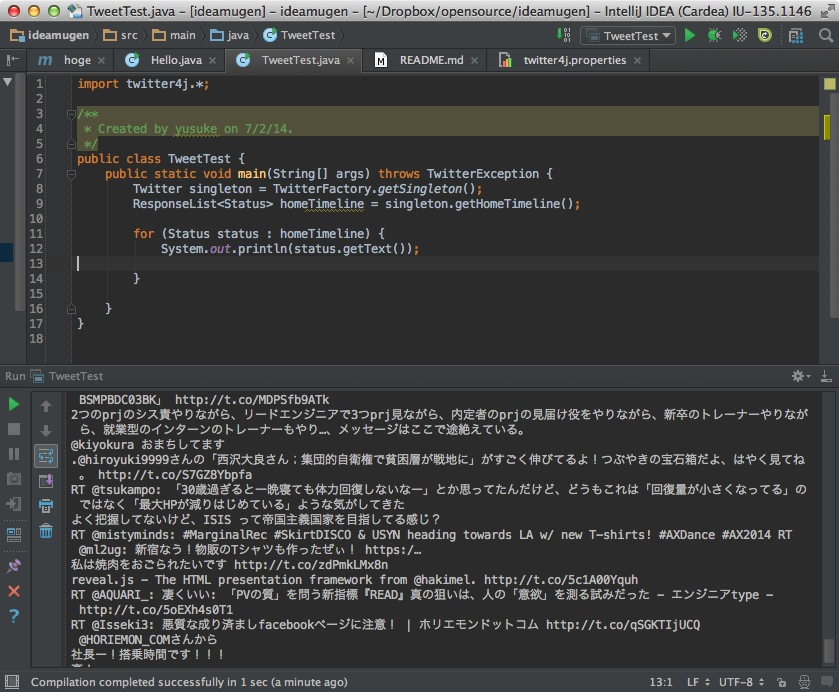
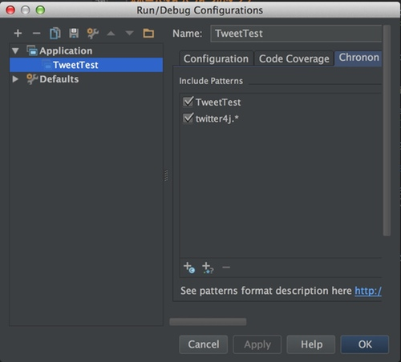
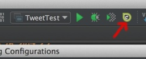

ideamugen
=========

#Twitter APIの基本
##REST API
Twitter APIの中でも基本。HTTP(GETまたはPOST)でリクエストし、jsonでレスポンスを受け取る。あとは口頭説明。
##Search API
元々サードパーティの会社が作っていた検索サービスをTwitterが買収したもの。今はREST APIの仲間扱い。あとは口頭説明。
##Streaming API
タイムラインやDMなどをリアルタイムに受信できる。httpsで接続しっぱなしでデータを受信する特殊なAPI。WebSocketやCometではない。あとは口頭説明。
#環境準備
[IntelliJ IDEA](http://www.jetbrains.com/idea/download/)の最新版(13.1.3)をインストール。Preferences->Plugins->Install JetBrains PluginsよりLive EditとChrononをインストール。

#プロジェクトの作成
1. File->New Project...->Maven->(Create from archetypeは未チェックのまま)Next
2. GroupId: 任意、ArtifactId: 任意、Version:任意(1.0-SNAPSTOTのままでOK)→Next
3. Project Name: 任意、Project Location:任意→Next
4. プロジェクト作成ができたら"Maven projects need to be imported"と出るので"Enable Auto-Import"をクリック 

クリックしそこねたら後からPreferences...->Maven->Importing->Import Maven projects automaticallyにチェックを入れる

#Hello Worldアプリの作成
1. Cmd + 1(プロジェクトペインへフォーカス移動)→[プロジェクト名]→src→main→javaへ移動
2. Ctrl+N(またはFile>New...)->Java Class
3. Name: Hello、Kind: Class  

4. Helloクラスを作成できたらブレース内にカーソルを移動
5. "psvm"とタイプし、tab(LiveTemplate機能によりpublic static void mainに展開される)
6. "sout"とタイプし、tab
7. "Hello World"をタイプ
8. Shift + Ctrl + F10(またはRun>Run...)より実行  
Shift + Ctrl + F10では今カーソルがあるクラスのmainメソッド、またはカーソルがある位置のテストメソッド、テストケースだけれどもテストメソッド内にカーソルがない場合はそのテストクラスのテスト全てを実行する設定を仮に作って実行してくれます。実行時のパラメータなどを指定したい場合は右上のプルダウンメニューよりEdit Configruations...を、実行設定を保存したい場合はSave *** Configurationを選びます。  

#dev.twitter.comにおけるアプリケーション登録、アクセストークン作成
1. [dev.twitter.com](https://apps.twitter.com/app/new)にアクセス
2. Twitterアカウントでログイン
3. Name、Description(10文字以上)、Website(とりあえずhttps://twitter.com/自分のアカウント、でもOK)を記入
4. 開発者規約をよく読んで承諾したらYes, I agreeにチェックを入れてアプリ登録
5. Details>Application Settings>Access level>modify app permissionsより"Read and Write"に変更してアプリケーションからのツイートを可能にする
6. API Keysのタブに移動し、Access levelがRead and writeになっているのを確認する(反映までしばらく時間がかかることもあるので、なっていない場合は1、2分待ってリロード
7. API Keys>Create my access tokenを押してアクセストークンを生成。  
しばらく待ってからリロードするとアクセストークンが生成されているのでAPI key、API secret、Access token、Access token secretをsrc/main/resources/twitter4j.propertiesに保存  
  
  
参考:[Twitter4J-設定](http://twitter4j.org/ja/configuration.html)

#ホームタイムラインのダンプ
1. 新しいクラスを作り、mainメソッド内に"TwitterFactory"と記載
2. シンボルを解決出来ず、赤くハイライトされるのでalt+Enter>Add Maven Dependencyよりtwitter4j、バージョン4.xを依存に追加  
  
Twitter4Jが見つからない場合はPreferences>Maven>Repositoriesよりrepo1.maven.org/maven2を選択してUpdate  

3. 依存を追加したら、もう一度alt+Enter>Import Classでtwitter4j.TwitterFactoryをインポート
4. ".ge"と入力し、補完候補(getSingleton)が現れたらTabを押して補完
5. さらに".var"と入力し、変数を導入([postfix completion](http://blog.jetbrains.com/jp/2014/03/19/433))
6. Twitter型の変数より、getHomeTimeline()を呼び出し、さらにその戻り値もpostfix completionで変数に代入
7. TwitterExceptionをキャッチしていないと警告が出るので赤線が出ている箇所でalt+Enter>Add Exeption to Method Signatureで例外宣言を追加
8. homeTimelineをタイプしたらalt+Enter>Iterateでfor文を作成
9. soutとタイプしてtab(Live Template)、status.getText()をプリントするコードにする
10. 実行  

#Chrononを使ったデバッグ
Run>Edit Configurations...>Chrononよりタイムラインをダンプするクラスと、twitter4j.*をChrononのカバー対象として設定  
  
Run *** with Chronon(実行ボタンの三つ右の黄色いアイコン)より実行
  

#IDEAコード補完tips

#GitHubとの連携

#アプリケーションからのツイート

#Spring Bootによる簡単なWebアプリケーション化

